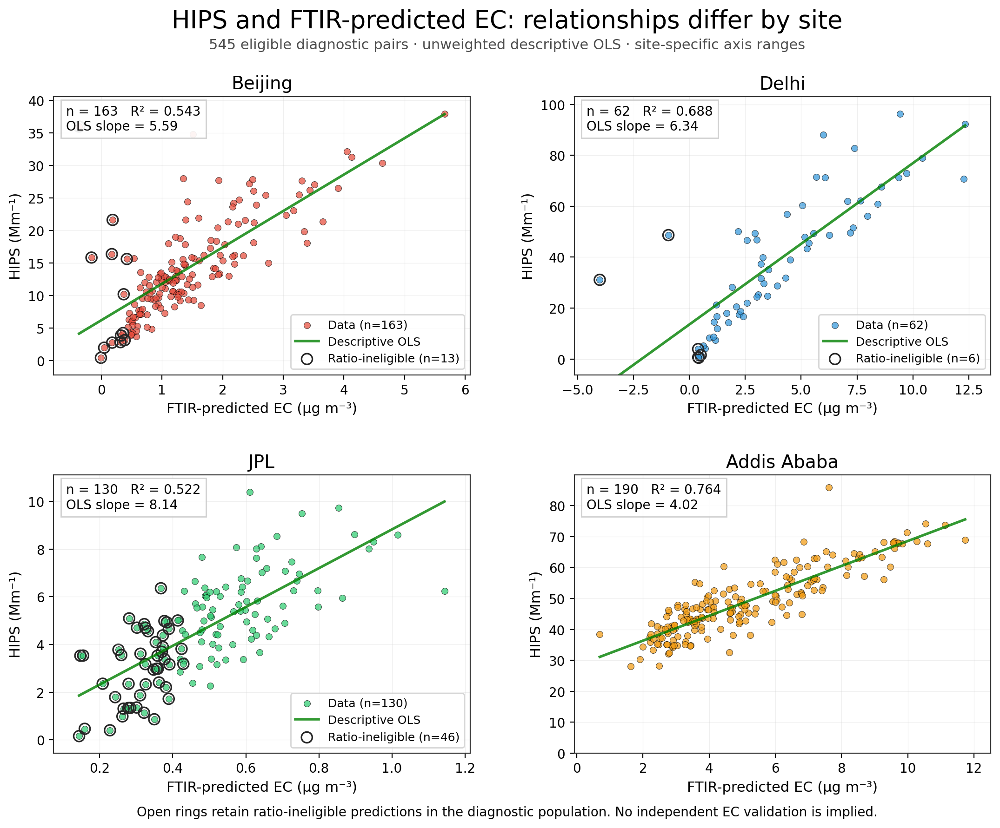
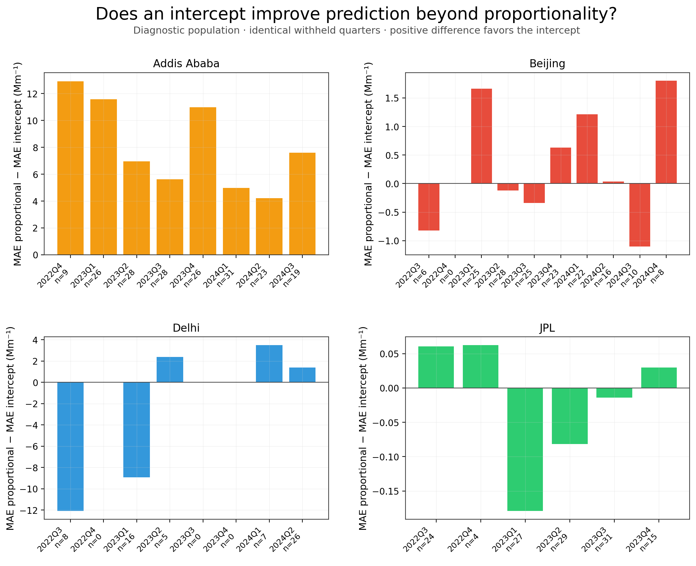
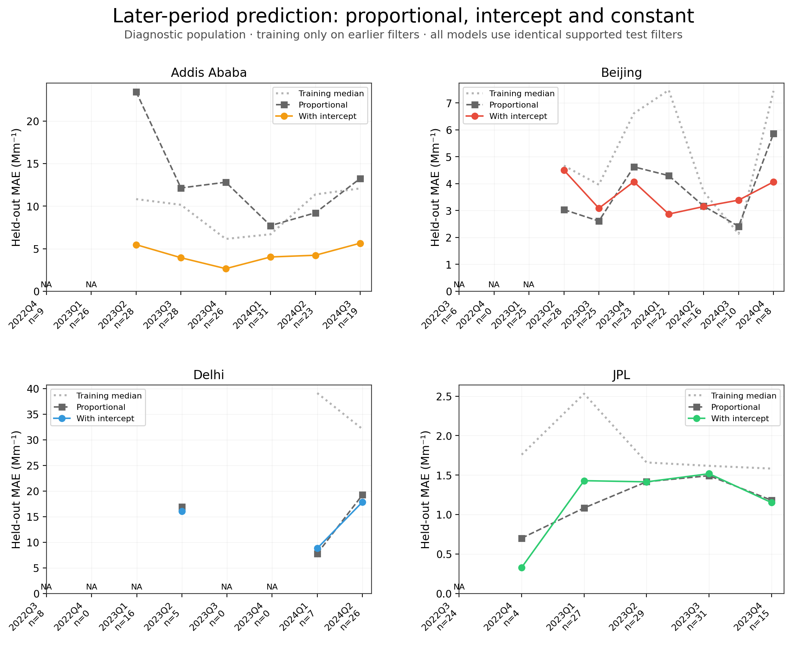
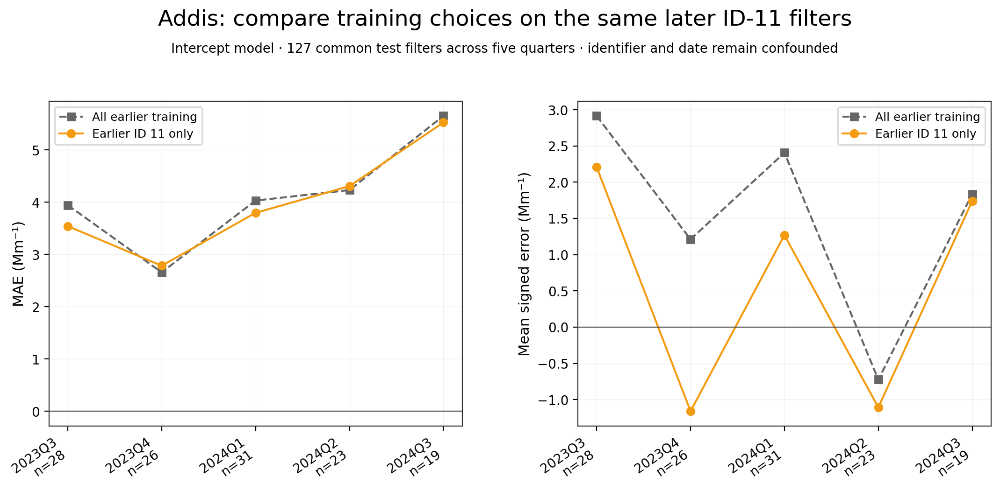

# Site dependent proportionality and temporal transfer of reported HIPS and FTIR predicted EC

Methods and Results

## Abstract

The usefulness of proportional prediction differed across four sites in a frozen cohort of 545 physical filters with paired reported HIPS and FTIR-predicted EC. We compared a training-median HIPS baseline, proportional least squares and ordinary least squares with an intercept using fixed reported-date calendar quarters. In Addis Ababa, the intercept model reduced withheld-quarter mean absolute error from 11.576 to 3.938 Mm⁻¹ and later-period error from 13.110 to 4.274 Mm⁻¹. The aggregate intercept advantage persisted when training and evaluation were restricted to CalibrationSetId 11. Other sites showed smaller or evaluation-dependent differences, and directional errors remained. These findings characterize prediction between reported products; they do not establish a physical conversion coefficient, independently validate EC or calibrate an aethalometer. [P1–P4]

## Methods

### Meaning and coverage of the baseline

The frozen study baseline means the retained physical-filter populations, flags, source-linked values and specified analysis rules. The prediction baseline means the training-median HIPS prediction used to judge predictive value; the proportional fit is a separate comparator. These terms do not mean that upstream FTIR spectral baseline correction has been independently reconstructed or verified. This draft consolidates the diagnostic, stability and proportionality reports, including their denominator sensitivities, influence checks, weighting choices and retained temporal failures. The accompanying coverage map separates these completed results from the pending source and instrument reviews. [P1–P5]

### Physical filter cohorts and reported quantities

The analysis combined records from Addis Ababa, Beijing, Delhi and JPL in Pasadena using physical filter identity. Replicate suffixes were normalized with the repository identity helper; original row identifiers, aliases, units, conflict flags and source hashes were retained. The frozen diagnostic cohort required a usable, non-conflicting same-filter pair of reported HIPS and FTIR-predicted EC and the existing registry eligibility decisions. It contained 545 physical filters. HIPS was analyzed in its reported absorption units, Mm⁻¹, and FTIR-predicted EC in µg/m³. The predictor is a reported prediction product, not an independently established, error-free EC reference. [P1]

**Table 1 Frozen physical filter populations**

| Site | Diagnostic n | Ratio n | 2× MDL n | Reported date range |
| --- | --- | --- | --- | --- |
| Addis Ababa | 190 | 190 | 189 | 2022-12-07 to 2024-09-21 |
| Beijing | 163 | 150 | 113 | 2022-07-05 to 2024-12-08 |
| Delhi | 62 | 56 | 52 | 2022-07-17 to 2024-06-30 |
| JPL | 130 | 84 | 7 | 2022-07-22 to 2023-11-14 |

Ratio eligibility retained 480 filters with positive EC meeting the frozen baseline MDL rule. Saved sensitivity memberships at 1.5×, 2×, 3× and 5× MDL were reused without threshold optimization. Below-MDL and nonpositive EC predictions retained their flags and remained in the diagnostic analysis; no values were substituted and no model predictions were clipped. The ratio summarizes reported HIPS divided by reported FTIR-predicted EC and is not interpreted as a physical mass absorption coefficient. [P1, P2]

### Reported date blocks and training procedures

Calendar quarters were assigned from the frozen reported dates, using January–March, April–June, July–September and October–December. The primary analysis withheld one quarter and trained on all remaining quarters, including earlier and later filters. The secondary analysis trained only on earlier quarters and tested the next quarter. These are complementary evaluations of the same observed record with overlapping test filters, not independent replications. Reported dates define these statistical blocks; they do not verify active sampling periods. [P2, P3]

For each site and frozen population, the compared predictions were the training median of HIPS, a proportional prediction Ĥ = kE, and an intercept-bearing prediction Ĥ = a + bE. The proportional coefficient was fitted by equal-filter least squares as k = Σ(EH)/Σ(E²), using training filters only. The intercept model used unweighted ordinary least squares. Each paired comparison required at least ten training filters and two distinct finite EC values. Empty or unsupported folds remained in the ledger, and all models were evaluated on identical supported test filters. No additional regression family, positivity rule or error-based exclusion was introduced. [P2, P3]

### Errors sensitivities and provenance

Signed error was predicted minus reported HIPS; positive values indicate overprediction. Mean absolute error was the main comparison metric. The paired intercept advantage was proportional MAE minus intercept-model MAE, so positive differences favor the intercept. Equal-filter summaries averaged over evaluated physical filters. Equal-quarter summaries assigned the same weight to each supported quarterly error; equal-quarter RMSE was the square root of mean quarterly MSE. Neither weighting was selected because it gave a preferred sign. No practical-equivalence margin was specified. [P3]

The bounded metadata sensitivity was restricted to Addis. On the same later ID-11 test filters, training on all eligible earlier filters was compared with training on earlier ID-11 filters only. Both training choices had to satisfy the original support rule. Identifiers were taken from actual EC source rows rather than inferred from date. CalibrationSetId definitions, model mappings, original FTIR training membership and the meaning of LotId as an analytical-batch field remain unresolved. The completed ETAD-0037 omission analysis was retained; no further individual exclusion search was performed. [P2–P4]

The descriptive results motivated the frozen stability specification, and the completed stability results motivated the separately frozen proportionality extension. Each specification preceded the fits it governed. This sequence supports held-out comparisons for the specified procedures but is not an entirely untouched confirmatory exercise. Holding a filter out downstream does not establish that it was held out when its upstream FTIR prediction was developed. [P2–P4]

## Results

### Denominator eligibility changes the represented population

The four site ratio distributions overlapped, while denominator eligibility affected them differently. The diagnostic and ratio cohorts contained 190/190 Addis filters, 163/150 Beijing filters, 62/56 Delhi filters and 130/84 JPL filters. At 2× MDL, Addis retained 189 filters and JPL retained seven. The JPL subset therefore remained a small sensitivity population and could not support the declared minimum training size. It was not treated as a replacement estimate of the JPL relationship. The point-level relationships are shown in Figure 1; complete denominator distributions and memberships accompany the release. [P1, P3]

### The predictive cost of proportionality is site dependent

At Addis, the intercept model improved on proportional prediction in all eight withheld quarters and all six supported later-period quarters. Primary MAE was 11.576 Mm⁻¹ for the proportional model, 8.888 Mm⁻¹ for the training-median baseline and 3.938 Mm⁻¹ with an intercept. Later-period MAEs were 13.110, 9.332 and 4.274 Mm⁻¹, respectively. Thus forcing this least-squares prediction through the origin performed poorly in the evaluated Addis record, even relative to a constant HIPS prediction. The aggregate intercept advantage persisted across the predefined denominator sensitivities. This result concerns prediction form and does not identify physical background absorption. [P3]

**Table 2 Equal filter mean absolute errors and paired model differences in Mm⁻¹**

| Site | Evaluation | Test n | Median | Proportional | Intercept | Difference |
| --- | --- | --- | --- | --- | --- | --- |
| Addis Ababa | Withheld quarter | 190 | 8.888 | 11.576 | 3.938 | +7.637 |
| Addis Ababa | Later period | 155 | 9.332 | 13.110 | 4.274 | +8.836 |
| Beijing | Withheld quarter | 163 | 5.638 | 3.992 | 3.563 | +0.429 |
| Beijing | Later period | 132 | 5.198 | 3.581 | 3.610 | -0.029 |
| Delhi | Withheld quarter | 62 | 28.890 | 11.844 | 14.534 | -2.689 |
| Delhi | Later period | 38 | 31.150 | 16.819 | 15.934 | +0.884 |
| JPL | Withheld quarter | 130 | 1.744 | 1.286 | 1.328 | -0.042 |
| JPL | Later period | 106 | 1.862 | 1.293 | 1.370 | -0.077 |

Beijing’s primary intercept advantage was +0.429 Mm⁻¹, but its equal-filter later-period advantage was −0.029 Mm⁻¹. Delhi favored proportional prediction in the primary diagnostic analysis by 2.689 Mm⁻¹; the aggregate primary proportional advantage also occurred in the ratio population and every supported MDL sensitivity. It was therefore not confined to nonpositive diagnostic denominators. Delhi’s later-period intercept advantage was +0.884 Mm⁻¹, while both EC-based models retained strong underprediction. JPL’s aggregate differences were small (−0.042 and −0.077 Mm⁻¹), without a specified margin permitting a declaration of equivalence. Figures 2 and 3 retain the quarter-specific differences and failures. [P3]

### Directional errors remain in temporal transfer

Addis’s near-zero primary intercept-model bias (+0.025 Mm⁻¹) coexisted with quarter-specific bias and later-period overprediction (+2.256 Mm⁻¹). Delhi’s later-period intercept-model mean error was −15.298 Mm⁻¹, close in magnitude to its MAE of 15.934 Mm⁻¹, indicating strongly directional error. Beijing 2024Q3 remained a failure relative to the median baseline despite all ten test EC values lying inside the training minimum and maximum. Range overlap alone did not explain that failure. [P2, P3]

**Table 3 Intercept model signed errors under both weighting choices in Mm⁻¹**

| Site | Evaluation | Equal filters | Equal quarters |
| --- | --- | --- | --- |
| Addis Ababa | Withheld quarter | +0.025 | -0.333 |
| Addis Ababa | Later period | +2.256 | +2.130 |
| Beijing | Withheld quarter | +0.000 | +0.176 |
| Beijing | Later period | +0.967 | +0.672 |
| Delhi | Withheld quarter | -1.779 | +2.151 |
| Delhi | Later period | -15.298 | -13.626 |
| JPL | Withheld quarter | +0.048 | -0.063 |
| JPL | Later period | +0.239 | +0.143 |

Delhi’s primary mean signed error changed sign from −1.779 Mm⁻¹ with equal-filter weights to +2.151 Mm⁻¹ with equal-quarter weights. In later-period evaluation, the final quarter contributed 26 of 38 test filters (68.4%) and 76.6% of total intercept-model absolute error, calculated by summing test count multiplied by block MAE. The first percentage describes sample composition; the second describes error contribution. Both weighting estimands and the complete block ledger are retained. [P3]

### The intercept advantage persists within CalibrationSetId 11

The strongest ID-11 result concerns model form. When training and evaluation were both restricted to ID-11 filters, proportional MAE was 9.968 Mm⁻¹ and intercept-model MAE was 3.884 Mm⁻¹, an aggregate advantage of 6.084 Mm⁻¹ (61.0% lower MAE). Pooling IDs 11 and 17 was therefore not required for the aggregate intercept advantage. This statement does not assume that either ID denotes a documented FTIR model version, and it does not assert an identical advantage in every ID-11 quarter. [P4]

Training composition produced a separate, smaller change. On 127 common test filters in five supported later quarters, restricting training lowered intercept-model MAE from 4.009 to 3.884 Mm⁻¹ (3.1%). Mean signed error decreased from +1.621 to +0.619 Mm⁻¹, a change of 1.002 Mm⁻¹. Restricted training improved MAE in three quarters and worsened it in two. Figure 4 shows those common-filter comparisons. Date and identifier were confounded, so these changes do not establish a causal processing effect. [P4]

## Interpretation and scope

The completed comparison supports an intercept-bearing empirical prediction for Addis under the tested specification and documents site-dependent limits elsewhere. It does not establish a time-invariant conversion, identify the physical or processing origin of an offset, independently validate FTIR EC or provide an aethalometer calibration. Resolving upstream result roles, calibration-set definitions and training membership is the next evidential task. No additional regression model or residual-mean correction is required to complete the stated filter-only comparison.

The instrument comparison remains separate. The USPA-0257 package contains source-linked reported bounds, a session-46 record crosswalk and a limited status screen, but active collection and clock alignment, observation/correction history, export-specific scaling and an applicable quality decision are unresolved. The candidate does not currently qualify for a reviewed interval comparison. Documented and appropriate corrections can be compatible with valid observations; an absence of corrections is not required. One future accepted candidate would demonstrate the processing path, not establish calibration. [P5]

## Source and reproducibility references

[P1] Frozen cohorts and descriptive results. [analysis_points.parquet](data/diagnostic/analysis_points.parquet); [site_results.parquet](data/diagnostic/site_results.parquet); [distribution_summary.parquet](data/diagnostic/distribution_summary.parquet); [sensitivity_point_links.parquet](data/diagnostic/sensitivity_point_links.parquet)

[P2] Reported date stability specification and outputs. [filter-relationship-stability-spec-2026-09-10.md](specifications/filter-relationship-stability-spec-2026-09-10.md); [block_performance_and_influence.parquet](data/stability/block_performance_and_influence.parquet); [heldout_filter_predictions.parquet](data/stability/heldout_filter_predictions.parquet)

[P3] Proportionality specification and outputs. [filter-proportionality-spec-v2-2026-09-10.md](specifications/filter-proportionality-spec-v2-2026-09-10.md); [proportionality_summary.parquet](data/proportionality/proportionality_summary.parquet); [proportionality_blocks.parquet](data/proportionality/proportionality_blocks.parquet); [proportionality_predictions.parquet](data/proportionality/proportionality_predictions.parquet)

[P4] Common ID 11 comparisons and source metadata. [id11_training_summary.parquet](data/proportionality/id11_training_summary.parquet); [id11_paired_changes.parquet](data/proportionality/id11_paired_changes.parquet); [id11_training_blocks.parquet](data/proportionality/id11_training_blocks.parquet); [FTIR_calibration_identifier_filter_links.csv](data/proportionality/FTIR_calibration_identifier_filter_links.csv)

[P5] Candidate instrument evidence. [proportionality_USPA-0257_evidence_package.md](phase_reports/proportionality_USPA-0257_evidence_package.md); [USPA-0257_evidence_register.csv](data/proportionality/USPA-0257_evidence_register.csv)

The release includes a claim ledger with table hashes and row selectors, a figure ledger linking each selected figure to its source population and specification, and a reproduction entry point with pinned dependencies. Archival source manifests preserve original provenance paths; the release entry point and reader links use the included files. The documented release check repeats the frozen analyses in a fresh environment outside the original checkout.

## Figure 1 Reported HIPS and FTIR predicted EC relationships

The frozen diagnostic physical-filter pairs are shown with descriptive within-site OLS relationships. HIPS and EC have different units; these panels do not assert a 1:1 physical relationship. Source P1.

## Figure 2 Paired proportionality comparison

Quarter-specific proportional MAE minus intercept-model MAE in reported HIPS units. Positive bars favor an intercept. Models share identical held-out filters; site-specific vertical scales should be read separately. Source P3.

## Figure 3 Later period prediction

Training-median, proportional and intercept-model MAE using strictly earlier training filters. Unavailable folds remain shown. These evaluations overlap the primary record and are not independent replications. Directional errors are reported in Table 3. Source P3.

## Figure 4 Common ID 11 training comparisons

Intercept-model errors on the same 127 later ID-11 test filters under two training choices. The aggregate within-ID-11 proportional-versus-intercept comparison is separately reported in the Results. Restricted training does not improve every quarter; identifier and date remain confounded. Source P4.
