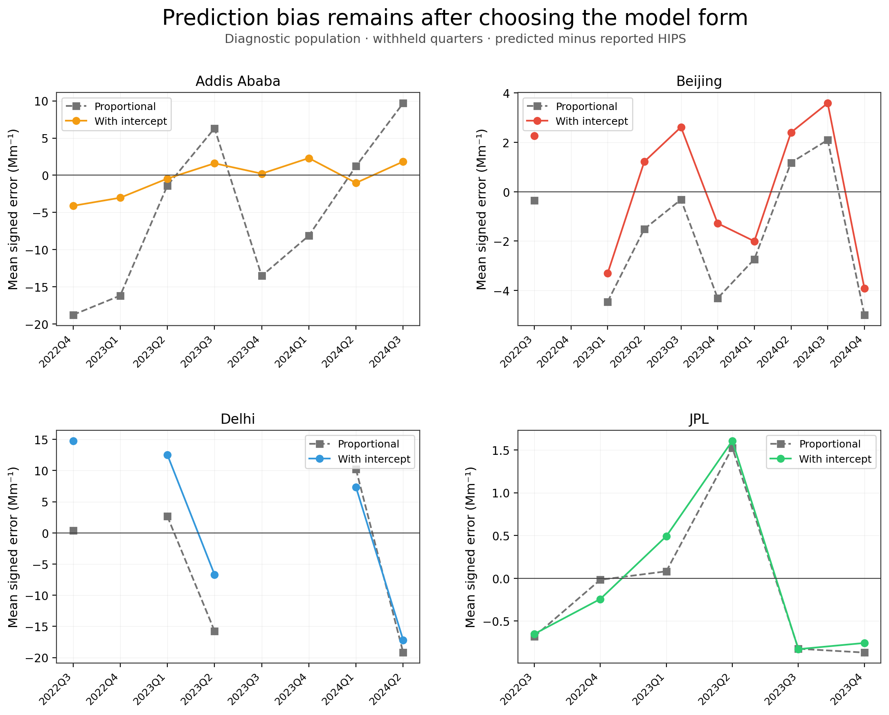
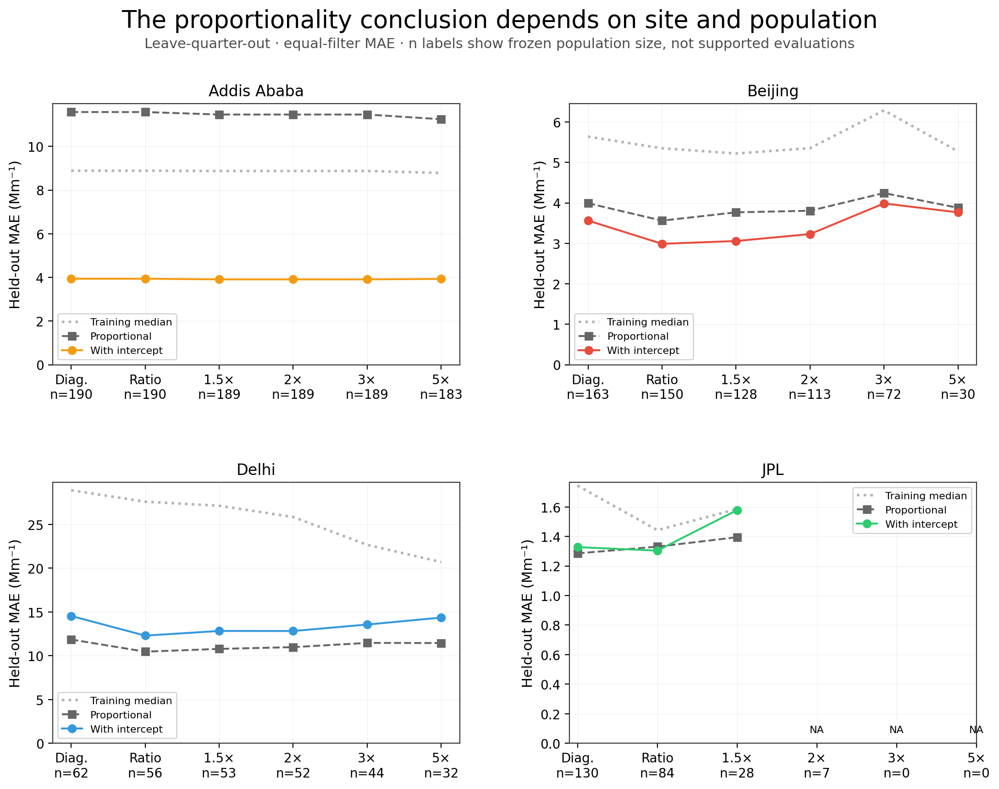
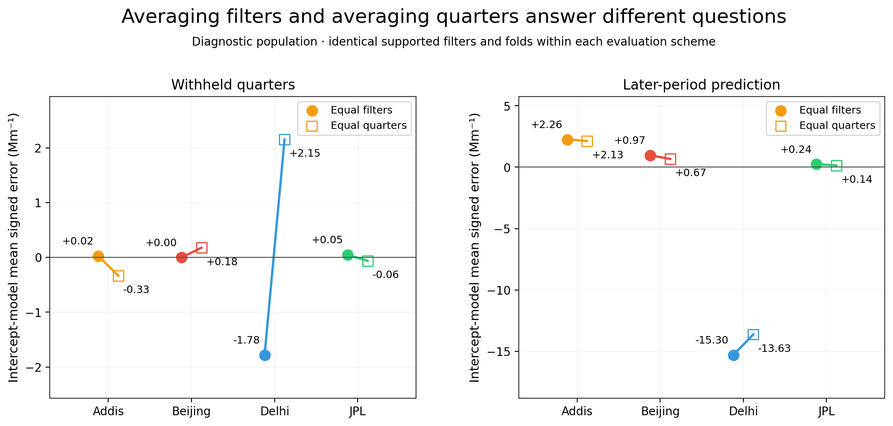
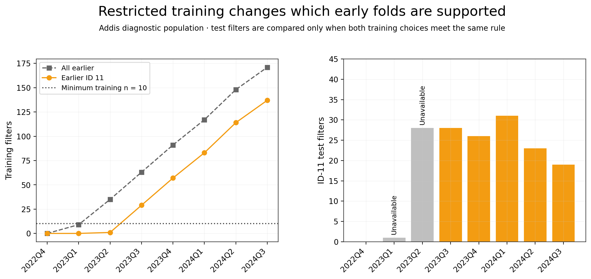
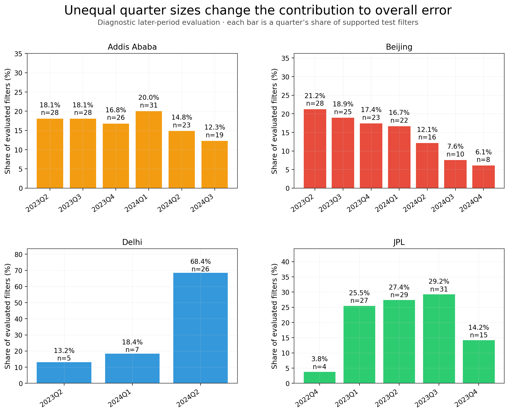

# Proportionality and limits of temporal transfer — specification v2

**Addis benefits consistently from an intercept under this evaluation; the other sites do not show the same pattern.** For Addis, withheld-quarter MAE is 11.576 Mm⁻¹ for proportional prediction versus 3.938 Mm⁻¹ with an intercept (paired improvement 7.637 Mm⁻¹, 66.0%). The intercept wins all eight quarters. In later-period prediction, MAE is 13.110 versus 4.274 Mm⁻¹ and the intercept wins all six supported quarters. This supports an intercept-bearing empirical prediction over the tested proportional benchmark in this record. It does not establish a physical offset, a time-invariant conversion or independently accurate EC.

**The conclusion is site-specific.** Beijing’s primary intercept advantage is 0.429 Mm⁻¹ with five of nine quarters improved; its later-period filter-weighted advantage is −0.029 Mm⁻¹. Delhi’s primary proportional MAE is 11.844 versus 14.534 Mm⁻¹ with an intercept, despite three of five quarters favoring the intercept. JPL differences are small: the intercept has primary MAE 1.328 versus proportional 1.286 Mm⁻¹. No practical-equivalence margin was specified, so small differences are described rather than declared equivalent.

**Temporal bias and unequal weights matter.** Delhi’s primary intercept-model bias changes sign from −1.779 Mm⁻¹ with equal filter weights to +2.151 Mm⁻¹ with equal quarter weights. Its later-period bias is strongly negative under both weightings (−15.298 and −13.626 Mm⁻¹); 26 filters in 2024Q2 contribute 68.4% of its 38 evaluated filters. This is an estimand difference, not a discrepancy. Beijing 2024Q3 remains in both evaluations; zero test EC values lie outside the training range, so range extrapolation alone does not explain that quarter’s failure.

**Restricting Addis training to ID 11 gives a modest improvement on common later ID-11 filters.** Both choices support 127 test filters across five quarters. Intercept-model MAE falls from 4.009 to 3.884 Mm⁻¹ (−0.125), and mean signed error falls from +1.621 to +0.619 Mm⁻¹. The equal-quarter MAE change is −0.112 Mm⁻¹. This aggregate uses the same test filters under both training choices; it is not compared to the earlier 155-filter aggregate as though the evaluation set were unchanged. ID and date remain confounded; no causal processing claim or residual correction is made.

## Three predictions on the same frozen holdouts

The completed stability analysis and its specification remain unchanged. This extension was chosen after its results were inspected and [specification v2] (external source recorded in provenance) was hashed before the new fits. The original 545 diagnostic / 480 ratio pairs, sensitivity memberships, calendar blocks, training IDs and support rules are unchanged. ETAD-0037 remains in the baseline; its completed omission result is retained by reference.

Training median predicts a constant HIPS value. Proportional least squares predicts kE with k = sum(EH)/sum(E²), calculated from training filters only. OLS with intercept predicts a+bE. Existing median/OLS predictions were copied, not changed. No positivity filter or prediction clipping was introduced; the five nonpositive diagnostic EC values remain and can yield nonpositive proportional predictions.

All errors use reported HIPS units (Mm⁻¹). Signed error = prediction − reported HIPS. The paired MAE difference is proportional minus intercept; positive favors the intercept. Both models use identical supported test filters, with at least ten training filters and two distinct EC values.

## Primary: withheld-quarter stability

| site | weighting | evaluated_filters | evaluated_blocks | intercept_better_blocks | median_mae | proportional_mae | ols_mae | delta_mae_proportional_minus_ols |
| --- | --- | --- | --- | --- | --- | --- | --- | --- |
| Addis_Ababa | equal_filter | 190 | 8 | 8 | 8.888 | 11.576 | 3.938 | 7.637 |
| Addis_Ababa | equal_quarter | 190 | 8 | 8 | 8.918 | 12.279 | 4.170 | 8.109 |
| Beijing | equal_filter | 163 | 9 | 5 | 5.638 | 3.992 | 3.563 | 0.429 |
| Beijing | equal_quarter | 163 | 9 | 5 | 5.222 | 3.817 | 3.489 | 0.328 |
| Delhi | equal_filter | 62 | 5 | 3 | 28.890 | 11.844 | 14.534 | -2.689 |
| Delhi | equal_quarter | 62 | 5 | 3 | 27.960 | 10.438 | 13.182 | -2.744 |
| JPL | equal_filter | 130 | 6 | 3 | 1.744 | 1.286 | 1.328 | -0.042 |
| JPL | equal_quarter | 130 | 6 | 3 | 1.811 | 1.156 | 1.177 | -0.020 |

Training includes earlier and later quarters. This evaluates stability across the observed record, not prospective prediction.

## Secondary: later-period prediction

| site | weighting | evaluated_filters | evaluated_blocks | intercept_better_blocks | median_mae | proportional_mae | ols_mae | delta_mae_proportional_minus_ols |
| --- | --- | --- | --- | --- | --- | --- | --- | --- |
| Addis_Ababa | equal_filter | 155 | 6 | 6 | 9.332 | 13.110 | 4.274 | 8.836 |
| Addis_Ababa | equal_quarter | 155 | 6 | 6 | 9.550 | 13.095 | 4.332 | 8.763 |
| Beijing | equal_filter | 132 | 7 | 4 | 5.198 | 3.581 | 3.610 | -0.029 |
| Beijing | equal_quarter | 132 | 7 | 4 | 5.141 | 3.715 | 3.589 | 0.126 |
| Delhi | equal_filter | 38 | 3 | 2 | 31.150 | 16.819 | 15.934 | 0.884 |
| Delhi | equal_quarter | 38 | 3 | 2 | 28.741 | 14.647 | 14.223 | 0.425 |
| JPL | equal_filter | 106 | 5 | 3 | 1.862 | 1.293 | 1.370 | -0.077 |
| JPL | equal_quarter | 106 | 5 | 3 | 1.830 | 1.174 | 1.168 | 0.006 |

Training includes strictly earlier quarters. Unsupported early folds remain visible. The two evaluation schemes have different test populations and are not a controlled algorithm comparison.

## Directional error under both weighting choices

| site | scheme | weighting | median_mean_signed_error | proportional_mean_signed_error | ols_mean_signed_error | largest_test_block_fraction |
| --- | --- | --- | --- | --- | --- | --- |
| Addis_Ababa | leave_quarter_out | equal_filter | -1.614 | -4.441 | 0.025 | 0.163 |
| Addis_Ababa | leave_quarter_out | equal_quarter | -1.684 | -5.100 | -0.333 | 0.163 |
| Addis_Ababa | later_period | equal_filter | -4.211 | 4.299 | 2.256 | 0.200 |
| Addis_Ababa | later_period | equal_quarter | -4.717 | 4.556 | 2.130 | 0.200 |
| Beijing | leave_quarter_out | equal_filter | -1.337 | -1.983 | 0.000 | 0.172 |
| Beijing | leave_quarter_out | equal_quarter | -1.363 | -1.710 | 0.176 | 0.172 |
| Beijing | later_period | equal_filter | -1.060 | -1.657 | 0.967 | 0.212 |
| Beijing | later_period | equal_quarter | -1.584 | -1.562 | 0.672 | 0.212 |
| Delhi | leave_quarter_out | equal_filter | -4.789 | -7.434 | -1.779 | 0.419 |
| Delhi | leave_quarter_out | equal_quarter | 2.845 | -4.342 | 2.151 | 0.419 |
| Delhi | later_period | equal_filter | -29.711 | -15.982 | -15.298 | 0.684 |
| Delhi | later_period | equal_quarter | -26.029 | -13.168 | -13.626 | 0.684 |
| JPL | leave_quarter_out | equal_filter | 0.019 | -0.066 | 0.048 | 0.238 |
| JPL | leave_quarter_out | equal_quarter | -0.353 | -0.131 | -0.063 | 0.238 |
| JPL | later_period | equal_filter | 0.346 | 0.078 | 0.239 | 0.292 |
| JPL | later_period | equal_quarter | 0.035 | 0.090 | 0.143 | 0.292 |

Equal-filter errors average over observed filters; equal-quarter errors average the supported quarterly errors. Equal-quarter RMSE is the square root of mean quarterly MSE. No weighting was chosen because it gave a preferred sign. The largest_test_block_fraction is unchanged across weighting rows because it describes sample composition.

## Fixed denominator sensitivities

| site | population | evaluated_filters | evaluated_blocks | intercept_better_blocks | proportional_mae | ols_mae | delta_mae_proportional_minus_ols |
| --- | --- | --- | --- | --- | --- | --- | --- |
| Addis_Ababa | diagnostic | 190 | 8 | 8 | 11.576 | 3.938 | 7.637 |
| Addis_Ababa | ratio_baseline | 190 | 8 | 8 | 11.576 | 3.938 | 7.637 |
| Addis_Ababa | mdl_1_5x | 189 | 8 | 8 | 11.462 | 3.910 | 7.552 |
| Addis_Ababa | mdl_2x | 189 | 8 | 8 | 11.462 | 3.910 | 7.552 |
| Addis_Ababa | mdl_3x | 189 | 8 | 8 | 11.462 | 3.910 | 7.552 |
| Addis_Ababa | mdl_5x | 183 | 8 | 8 | 11.248 | 3.931 | 7.316 |
| Beijing | diagnostic | 163 | 9 | 5 | 3.992 | 3.563 | 0.429 |
| Beijing | ratio_baseline | 150 | 9 | 7 | 3.561 | 2.988 | 0.573 |
| Beijing | mdl_1_5x | 128 | 9 | 7 | 3.767 | 3.057 | 0.710 |
| Beijing | mdl_2x | 113 | 9 | 6 | 3.806 | 3.229 | 0.576 |
| Beijing | mdl_3x | 72 | 9 | 6 | 4.244 | 3.987 | 0.257 |
| Beijing | mdl_5x | 30 | 8 | 4 | 3.878 | 3.765 | 0.113 |
| Delhi | diagnostic | 62 | 5 | 3 | 11.844 | 14.534 | -2.689 |
| Delhi | ratio_baseline | 56 | 5 | 2 | 10.458 | 12.289 | -1.830 |
| Delhi | mdl_1_5x | 53 | 5 | 3 | 10.772 | 12.820 | -2.049 |
| Delhi | mdl_2x | 52 | 5 | 3 | 10.974 | 12.817 | -1.843 |
| Delhi | mdl_3x | 44 | 5 | 2 | 11.455 | 13.554 | -2.098 |
| Delhi | mdl_5x | 32 | 5 | 2 | 11.443 | 14.348 | -2.904 |
| JPL | diagnostic | 130 | 6 | 3 | 1.286 | 1.328 | -0.042 |
| JPL | ratio_baseline | 84 | 6 | 4 | 1.331 | 1.304 | 0.027 |
| JPL | mdl_1_5x | 28 | 6 | 2 | 1.395 | 1.578 | -0.183 |
| JPL | mdl_2x | 0 | 0 | 0 | — | — | — |
| JPL | mdl_3x | 0 | 0 | 0 | — | — | — |
| JPL | mdl_5x | 0 | 0 | 0 | — | — | — |

Full population n and EC/date ranges remain in the [frozen membership summary](../data/stability/population_membership_summary.parquet). In particular, JPL has seven filters at 2× MDL and zero supported model evaluations; these counts are not interchangeable. The predefined sensitivity populations are not threshold candidates from which the best score is selected.

## Bounded ID-11 training sensitivity

| training_choice | weighting | evaluated_filters | evaluated_blocks | median_mae | proportional_mae | ols_mae | ols_mean_signed_error |
| --- | --- | --- | --- | --- | --- | --- | --- |
| all_earlier | equal_filter | 127 | 5 | 9.003 | 10.833 | 4.009 | 1.621 |
| all_earlier | equal_quarter | 127 | 5 | 9.294 | 11.026 | 4.103 | 1.529 |
| id11_earlier | equal_filter | 127 | 5 | 9.671 | 9.968 | 3.884 | 0.619 |
| id11_earlier | equal_quarter | 127 | 5 | 9.921 | 10.104 | 3.991 | 0.590 |

All models use exactly the same ID-11 test filters under both training choices. The first ID-11 test quarter contains one filter; the next contains 28, but the restricted model has only one earlier ID-11 training filter. Both early quarters therefore remain unavailable for a paired comparison. Five subsequent quarters satisfy the shared rule.

| population | block | common_n | median_mae_change_id11_minus_all | proportional_mae_change_id11_minus_all | ols_mae_change_id11_minus_all |
| --- | --- | --- | --- | --- | --- |
| diagnostic | ALL_COMMON_FILTERS | 127 | 0.669 | -0.865 | -0.125 |
| diagnostic | 2023Q3 | 28 | -1.208 | -5.568 | -0.401 |
| diagnostic | 2023Q4 | 26 | 5.066 | 2.120 | 0.126 |
| diagnostic | 2024Q1 | 31 | 0.230 | 1.329 | -0.235 |
| diagnostic | 2024Q2 | 23 | -0.497 | -0.736 | 0.076 |
| diagnostic | 2024Q3 | 19 | -0.456 | -1.756 | -0.125 |

Negative changes mean lower MAE with ID-11-only training. Quarter-specific losses remain visible. The [full common-support ledger](../data/proportionality/id11_training_blocks.csv) records training/test IDs, counts, ranges and reasons. The [paired predictions](../data/proportionality/id11_paired_predictions.parquet) preserve original measurement links. All-earlier median/OLS predictions were reconciled to the previous predictions on the common filters.

## Evidence packages

[The extended upstream packet](proportionality_upstream_questions_v2_draft.md) is **drafted, not sent**. It preserves the original CHTS-0658 result-role question and exact source rows, and adds definitions/applicability of IDs 11/17, model/reference-target mappings, true analytical-batch metadata and original training/evaluation membership. No result is labeled corrected; ChemSpec 217/218 are not treated as prediction versions. Holding filters out downstream does not establish upstream FTIR independence.

[USPA-0257’s candidate evidence package](proportionality_USPA-0257_evidence_package.md) now includes source-linked collection bounds, the retained session-46 record crosswalk, per-record non-destructive status flags, source definitions and exact remaining questions. All 1,440 rows report status 131648 and trigger none of the limited existing local status checks. This is a candidate screen, not an approved quality decision. Manual-time alignment, active collection and the session-specific observation/correction and quantity-scaling trace remain unresolved. The nominal manufacturer IR BCc unit is identified, but no reviewed eBC mean or absorption comparison is produced. No database search was repeated.

## Reproduction

Run `uv run aeth doctor`, then `uv run python research/ftir_hips_chem/workflows/analyze_filter_proportionality.py`. Add `--notebook` to generate the active notebook and execute its archived copy. Frozen source hashes, specification hash and output/code hashes are in [prefit freeze](../data/proportionality/prefit_freeze.json) and [manifest](../data/proportionality/manifest.json).

[All held-out predictions](../data/proportionality/proportionality_predictions.parquet) include the paired absolute-error differences. [Block comparisons](../data/proportionality/proportionality_blocks.csv) include training/test IDs, date/EC ranges, nonpositive counts and original split fingerprints. [Both weighting schemes](../data/proportionality/proportionality_summary.csv) and [all ID-11 sensitivity results](../data/proportionality/id11_training_summary.csv) are machine-readable.

## Figures

## Retained diagnostic block failures

| site | scheme | block | test_n | outside_training_ec_n | median_mae | proportional_mae | ols_mae | ols_mean_signed_error | delta_mae_proportional_minus_ols |
| --- | --- | --- | --- | --- | --- | --- | --- | --- | --- |
| Beijing | leave_quarter_out | 2022Q3 | 6 | 0.000 | 2.236 | 1.547 | 2.371 | 2.260 | -0.824 |
| Beijing | leave_quarter_out | 2023Q1 | 25 | 4.000 | 8.916 | 6.808 | 5.145 | -3.308 | 1.663 |
| Beijing | leave_quarter_out | 2023Q2 | 28 | 0.000 | 4.582 | 2.931 | 3.052 | 1.219 | -0.121 |
| Beijing | leave_quarter_out | 2023Q3 | 25 | 0.000 | 4.058 | 2.637 | 2.976 | 2.620 | -0.339 |
| Beijing | leave_quarter_out | 2023Q4 | 23 | 0.000 | 6.677 | 4.632 | 4.003 | -1.280 | 0.629 |
| Beijing | leave_quarter_out | 2024Q1 | 22 | 0.000 | 7.248 | 4.293 | 3.079 | -2.006 | 1.214 |
| Beijing | leave_quarter_out | 2024Q2 | 16 | 0.000 | 3.647 | 3.153 | 3.115 | 2.403 | 0.038 |
| Beijing | leave_quarter_out | 2024Q3 | 10 | 0.000 | 2.193 | 2.488 | 3.592 | 3.592 | -1.103 |
| Beijing | leave_quarter_out | 2024Q4 | 8 | 0.000 | 7.445 | 5.866 | 4.065 | -3.912 | 1.800 |
| Beijing | later_period | 2023Q2 | 28 | 0.000 | 4.668 | 3.033 | 4.498 | 2.997 | -1.465 |
| Beijing | later_period | 2023Q3 | 25 | 0.000 | 3.960 | 2.608 | 3.085 | 2.782 | -0.476 |
| Beijing | later_period | 2023Q4 | 23 | 0.000 | 6.607 | 4.623 | 4.069 | -1.375 | 0.554 |
| Beijing | later_period | 2024Q1 | 22 | 0.000 | 7.474 | 4.297 | 2.869 | -1.657 | 1.428 |
| Beijing | later_period | 2024Q2 | 16 | 0.000 | 3.697 | 3.165 | 3.148 | 2.483 | 0.017 |
| Beijing | later_period | 2024Q3 | 10 | 0.000 | 2.136 | 2.411 | 3.386 | 3.386 | -0.976 |
| Beijing | later_period | 2024Q4 | 8 | 0.000 | 7.445 | 5.866 | 4.065 | -3.912 | 1.800 |
| Delhi | leave_quarter_out | 2022Q3 | 8 | 0.000 | 35.782 | 2.694 | 14.768 | 14.768 | -12.074 |
| Delhi | leave_quarter_out | 2023Q1 | 16 | 0.000 | 23.581 | 3.606 | 12.532 | 12.532 | -8.926 |
| Delhi | leave_quarter_out | 2023Q2 | 5 | 1.000 | 22.795 | 15.754 | 13.367 | -6.679 | 2.387 |
| Delhi | leave_quarter_out | 2024Q1 | 7 | 0.000 | 25.532 | 10.908 | 7.409 | 7.316 | 3.499 |
| Delhi | leave_quarter_out | 2024Q2 | 26 | 1.000 | 32.111 | 19.230 | 17.836 | -17.183 | 1.394 |
| Delhi | later_period | 2023Q2 | 5 | 1.000 | 14.986 | 16.923 | 16.024 | -15.641 | 0.899 |
| Delhi | later_period | 2024Q1 | 7 | 3.000 | 39.124 | 7.788 | 8.808 | -8.054 | -1.020 |
| Delhi | later_period | 2024Q2 | 26 | 1.000 | 32.111 | 19.230 | 17.836 | -17.183 | 1.394 |
