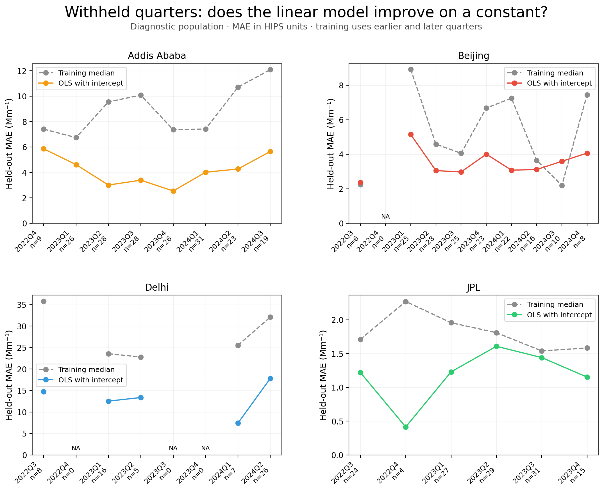
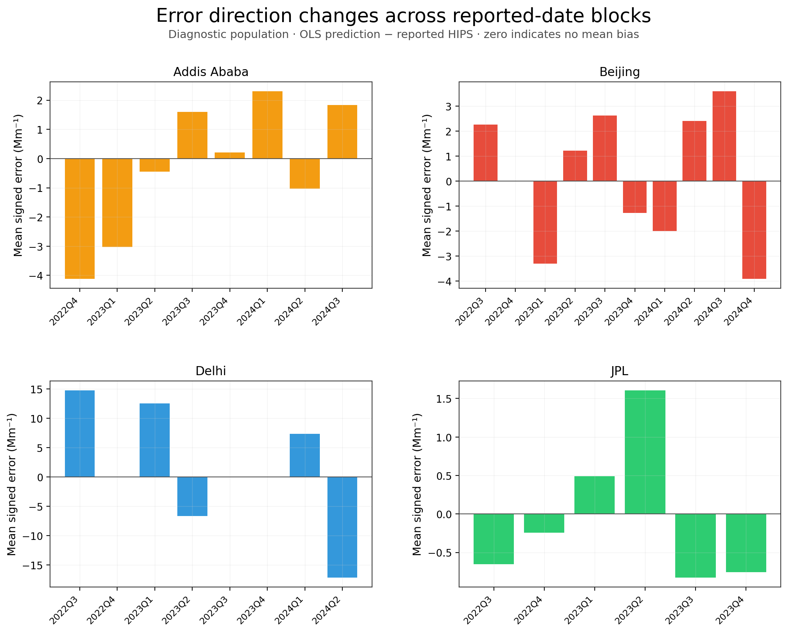
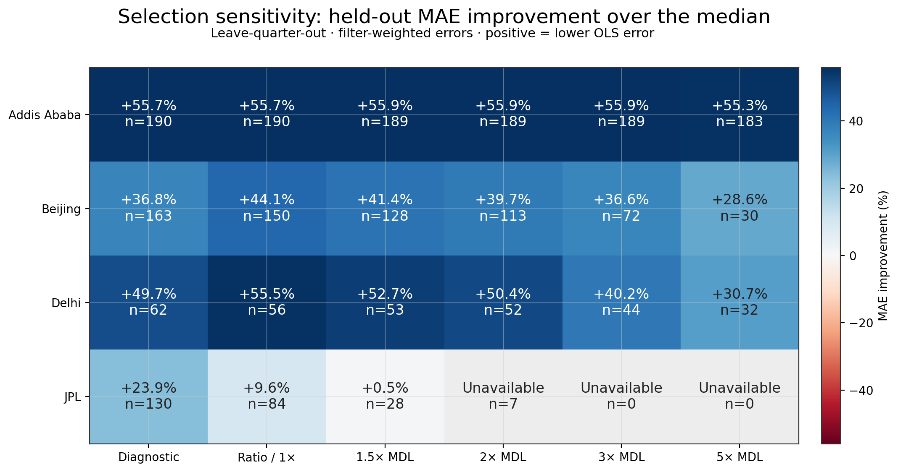
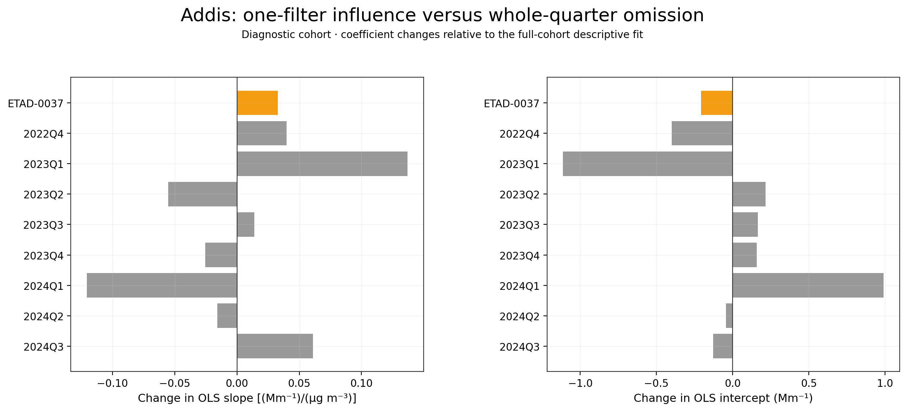
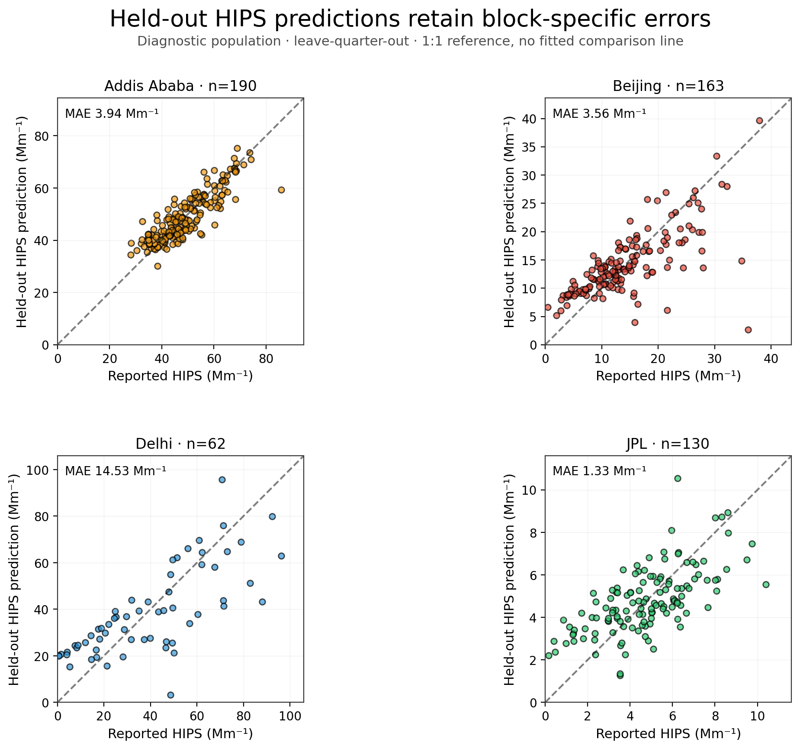
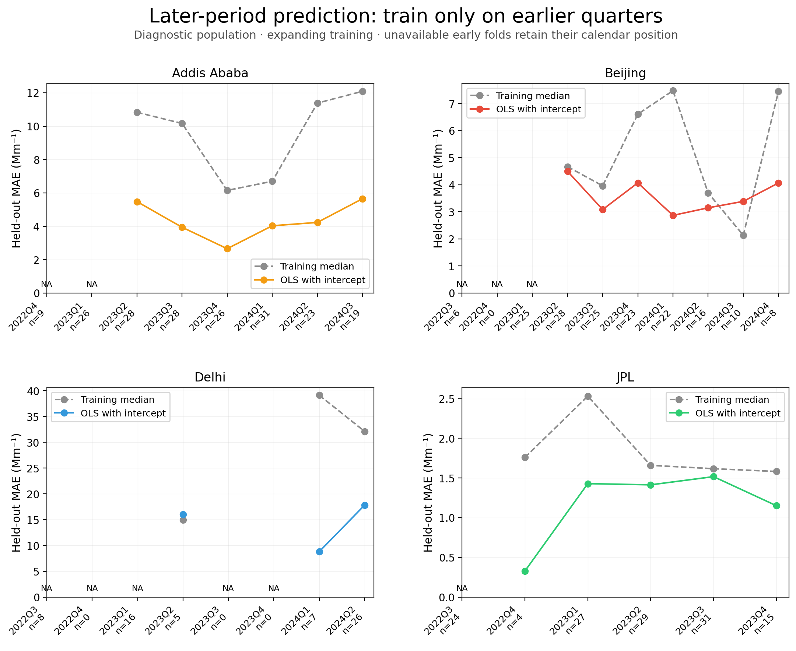
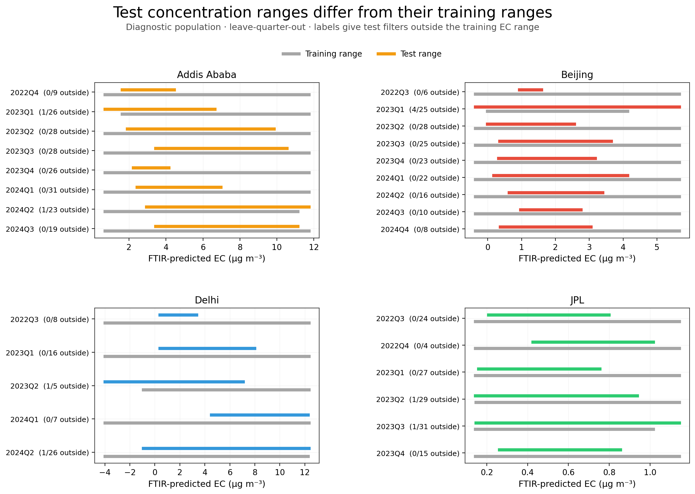
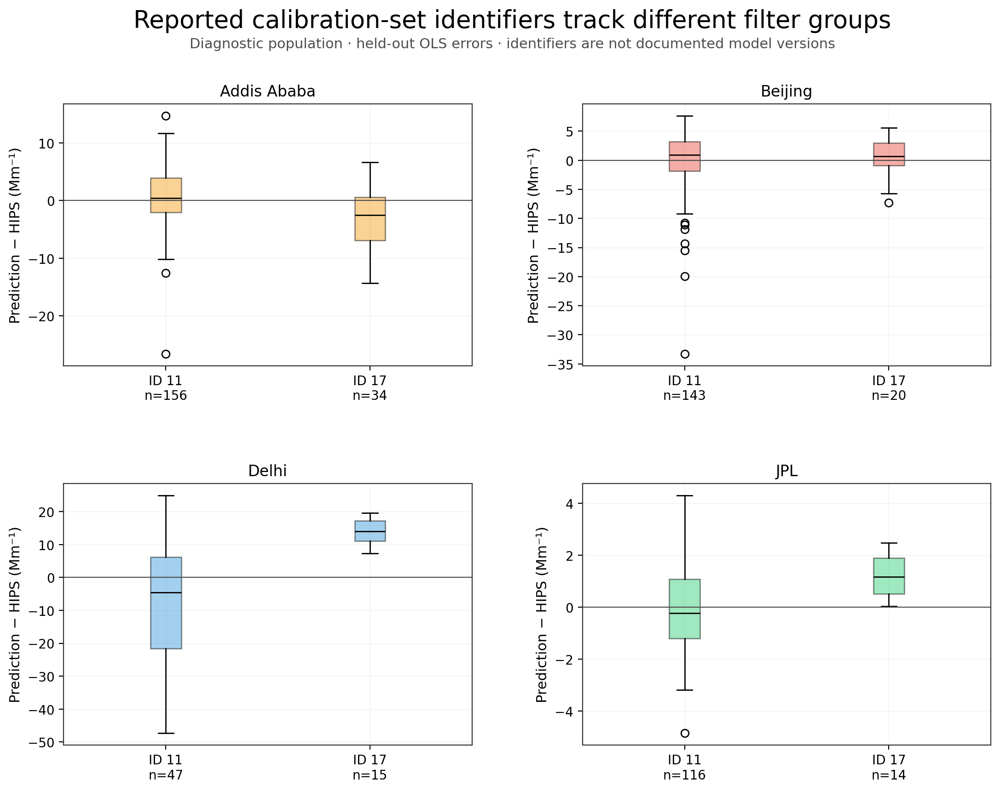
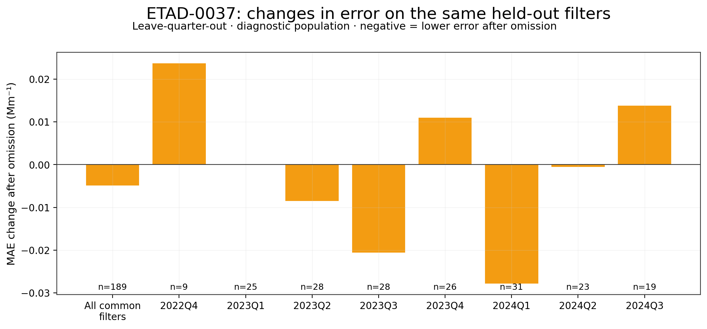

# Within-site stability of reported HIPS and FTIR-predicted EC

## Scientific finding

**Addis has a useful within-record relationship under this specification, with remaining temporal bias.** The linear model improves on the training median in all eight withheld quarters: MAE 3.938 versus 8.888 Mm⁻¹ (55.7% improvement). Block MAE ranges from 2.542 to 5.857 Mm⁻¹; block mean signed error ranges from −4.115 to +2.304 Mm⁻¹. The near-zero overall signed error therefore hides opposing block errors. Later-period MAE is 4.274 versus 9.332 Mm⁻¹ across 155 evaluated filters, with mean overprediction +2.256 Mm⁻¹.

**The Addis conclusion survives the existing denominator sensitivities and the ETAD-0037 check.** At 2× MDL, 189 filters retain 55.9% MAE improvement and all eight quarters improve. At 5×, 183 filters retain 55.3% improvement, but seven of eight quarters improve. Removing ETAD-0037 changes the full-cohort slope by +0.033 and intercept by −0.206 Mm⁻¹. On 189 common held-out filters its omission changes primary MAE by only −0.0049 Mm⁻¹; whole-quarter omissions change slope by −0.121 to +0.137 and intercept by −1.113 to +0.992 Mm⁻¹. The filter itself has a baseline held-out error of −8.309 Mm⁻¹. Its omission worsens later-period MAE on 155 common filters by +0.172 Mm⁻¹, concentrated in the first evaluated later block. It does not account for the persistent quarter-level structure.

**The same specification gives heterogeneous results elsewhere.** Beijing improves in seven of nine withheld quarters; 2024Q3 is worse than the constant baseline in both evaluations (10 test filters). Delhi improves in all five withheld quarters, but later-period prediction has substantial underprediction (mean error −15.298 Mm⁻¹), and its five-filter 2023Q2 block is worse than the baseline. JPL improves in all six diagnostic quarters, but aggregate improvement falls from 23.9% to 9.6% for ratio eligibility and 0.5% at 1.5× MDL. The seven-point 2× subset cannot support the declared training minimum. These comparisons describe different populations, not a search for the best threshold.

**Processing metadata and time are confounded in Addis.** CalibrationSetId 17 appears on 34 diagnostic filters dated 7 December 2022–22 March 2023, with mean held-out error −3.178 Mm⁻¹. ID 11 appears on the other 156 filters, dated 29 March 2023–21 September 2024, with mean error +0.723 Mm⁻¹. This is an identifiable processing association, not evidence that a documented model change caused the difference. The model-version mapping and original FTIR training membership remain unresolved. No atmospheric attribution follows from this analysis.

The descriptive baseline is unchanged: 545 diagnostic and 480 ratio pairs. The results below evaluate transfer across reported-date calendar quarters. They do not validate the original FTIR predictions, determine a physical MAC, or calibrate an aethalometer.

## Primary: withheld-quarter stability

Training uses all other quarters, including earlier and later filters. Positive MAE improvement means lower OLS error. All errors are in reported HIPS units, Mm⁻¹. Summary MAE weights each evaluated filter equally.

| site | evaluated_filters | evaluated_blocks | improved_blocks | median_mae | ols_mae | ols_mean_signed_error | mae_improvement_pct |
| --- | --- | --- | --- | --- | --- | --- | --- |
| Addis_Ababa | 190 | 8 | 8 | 8.888 | 3.938 | 0.025 | 55.686 |
| Beijing | 163 | 9 | 7 | 5.638 | 3.563 | 0.000 | 36.798 |
| Delhi | 62 | 5 | 5 | 28.890 | 14.534 | -1.779 | 49.693 |
| JPL | 130 | 6 | 6 | 1.744 | 1.328 | 0.048 | 23.892 |

## Secondary: later-period prediction

Training uses strictly earlier quarters. Early folds without 10 training filters remain unavailable; the different evaluated populations prevent direct interpretation of the two tables as a controlled algorithm comparison.

| site | evaluated_filters | evaluated_blocks | improved_blocks | median_mae | ols_mae | ols_mean_signed_error | mae_improvement_pct |
| --- | --- | --- | --- | --- | --- | --- | --- |
| Addis_Ababa | 155 | 6 | 6 | 9.332 | 4.274 | 2.256 | 54.196 |
| Beijing | 132 | 7 | 6 | 5.198 | 3.610 | 0.967 | 30.555 |
| Delhi | 38 | 3 | 2 | 31.150 | 15.934 | -15.298 | 48.846 |
| JPL | 106 | 5 | 5 | 1.862 | 1.370 | 0.239 | 26.430 |

## Fixed denominator sensitivities

Saved memberships are reused without threshold tuning. JPL at 2× MDL remains a seven-filter sensitivity; it is not a replacement estimate and has no supported paired model evaluation under the frozen training rule.

| site | population | evaluated_filters | evaluated_blocks | improved_blocks | ols_mae | median_mae | mae_improvement_pct |
| --- | --- | --- | --- | --- | --- | --- | --- |
| Addis_Ababa | diagnostic | 190 | 8 | 8 | 3.938 | 8.888 | 55.686 |
| Addis_Ababa | ratio_baseline | 190 | 8 | 8 | 3.938 | 8.888 | 55.686 |
| Addis_Ababa | mdl_1_5x | 189 | 8 | 8 | 3.910 | 8.877 | 55.948 |
| Addis_Ababa | mdl_2x | 189 | 8 | 8 | 3.910 | 8.877 | 55.948 |
| Addis_Ababa | mdl_3x | 189 | 8 | 8 | 3.910 | 8.877 | 55.948 |
| Addis_Ababa | mdl_5x | 183 | 8 | 7 | 3.931 | 8.786 | 55.254 |
| Beijing | diagnostic | 163 | 9 | 7 | 3.563 | 5.638 | 36.798 |
| Beijing | ratio_baseline | 150 | 9 | 8 | 2.988 | 5.350 | 44.145 |
| Beijing | mdl_1_5x | 128 | 9 | 8 | 3.057 | 5.221 | 41.438 |
| Beijing | mdl_2x | 113 | 9 | 7 | 3.229 | 5.353 | 39.673 |
| Beijing | mdl_3x | 72 | 9 | 9 | 3.987 | 6.287 | 36.592 |
| Beijing | mdl_5x | 30 | 8 | 6 | 3.765 | 5.272 | 28.581 |
| Delhi | diagnostic | 62 | 5 | 5 | 14.534 | 28.890 | 49.693 |
| Delhi | ratio_baseline | 56 | 5 | 5 | 12.289 | 27.585 | 55.452 |
| Delhi | mdl_1_5x | 53 | 5 | 5 | 12.820 | 27.119 | 52.724 |
| Delhi | mdl_2x | 52 | 5 | 5 | 12.817 | 25.833 | 50.386 |
| Delhi | mdl_3x | 44 | 5 | 5 | 13.554 | 22.654 | 40.171 |
| Delhi | mdl_5x | 32 | 5 | 5 | 14.348 | 20.693 | 30.665 |
| JPL | diagnostic | 130 | 6 | 6 | 1.328 | 1.744 | 23.892 |
| JPL | ratio_baseline | 84 | 6 | 5 | 1.304 | 1.442 | 9.602 |
| JPL | mdl_1_5x | 28 | 6 | 4 | 1.578 | 1.586 | 0.493 |
| JPL | mdl_2x | 0 | 0 | 0 | — | — | — |
| JPL | mdl_3x | 0 | 0 | 0 | — | — | — |
| JPL | mdl_5x | 0 | 0 | 0 | — | — | — |

Full membership counts, IDs, reported-date bounds and EC ranges, including zero-point populations, are in [population membership summary](../data/stability/population_membership_summary.csv) and [exact population links](../data/stability/population_point_links.parquet).

## ETAD-0037 influence

ETAD-0037 is retained in the baseline. No exclusion registry was edited. The named omission sensitivity compares errors on common evaluated filters only. Negative MAE change means lower error after omission.

| population | scheme | common_n | baseline_ols_mae | without_ols_mae | mae_change_without_minus_baseline | max_abs_prediction_change |
| --- | --- | --- | --- | --- | --- | --- |
| diagnostic | leave_quarter_out | 189 | 3.915 | 3.910 | -0.005 | 0.207 |
| diagnostic | later_period | 155 | 4.274 | 4.446 | 0.172 | 3.048 |
| ratio_baseline | leave_quarter_out | 189 | 3.915 | 3.910 | -0.005 | 0.207 |
| ratio_baseline | later_period | 155 | 4.274 | 4.446 | 0.172 | 3.048 |
| mdl_1_5x | leave_quarter_out | 189 | 3.910 | 3.910 | 0.000 | 0.000 |
| mdl_1_5x | later_period | 155 | 4.446 | 4.446 | 0.000 | 0.000 |
| mdl_2x | leave_quarter_out | 189 | 3.910 | 3.910 | 0.000 | 0.000 |
| mdl_2x | later_period | 155 | 4.446 | 4.446 | 0.000 | 0.000 |
| mdl_3x | leave_quarter_out | 189 | 3.910 | 3.910 | 0.000 | 0.000 |
| mdl_3x | later_period | 155 | 4.446 | 4.446 | 0.000 | 0.000 |
| mdl_5x | leave_quarter_out | 183 | 3.931 | 3.931 | 0.000 | 0.000 |
| mdl_5x | later_period | 154 | 4.296 | 4.296 | 0.000 | 0.000 |

Full-cohort coefficient references below describe influence only; their fitted errors are not held-out performance.

| variant | slope | intercept | delta_slope_from_original | delta_intercept_from_original |
| --- | --- | --- | --- | --- |
| baseline | 4.023 | 28.324 | 0.000 | 0.000 |
| without_ETAD_0037 | 4.056 | 28.118 | 0.033 | -0.206 |

Whole-quarter coefficient changes are included in [block performance and influence](../data/stability/block_performance_and_influence.csv); per-quarter changes in common-filter errors are in [paired influence](../data/stability/ETAD_0037_paired_influence.csv).

## Source-linked processing metadata

Each prediction links to actual EC_ftir source rows and their CalibrationSetId, AnalysisDate, AnalysisTime, LotId and MDL. Reported IDs 11/17 are calibration-set identifiers; their mapping to FTIR models or versions is not documented here. LotId is not established as an analytical batch. The residual summaries are descriptive and may be confounded by date, concentration and population membership. No new metadata-based model was fitted.

The recovered importer accepts already computed EC_ftir values from Four_Sites_FTIR_data.v2.csv. Existing repository notes identify ChemSpec EC as FTIR-derived, which agrees with the traced export description. Those notes do not establish the reference target, original training population, model/version mapping or whether these particular filters were held out upstream. Downstream regression holdouts cannot establish that independence. Earlier repository hypotheses treating ChemSpec as independent TOR are superseded by the source trace; method codes 217/218 are not used as prediction-model versions.

[Metadata-group dates and errors](../data/stability/processing_metadata_summary.csv) and [residuals by source metadata and quarter](../data/stability/processing_metadata_residuals.csv) include predictor and MDL ranges. No unresolved uncertainty field or general model RMSE was used to weight the regression.

## Upstream ChemSpec question packet

[The draft packet](stability_upstream_ChemSpec_question_packet.md) includes exact CHTS-0658 export rows, source SHA-256, metadata and mappings to unified rows 5859/5860. It has not been sent. Both competing values predate the recovered importer; neither is selected as authoritative and no parser was changed.

## One real instrument candidate

USPA-0257, reported UTC envelope 23 June 2023 16:00 to 24 June 2023 16:00: candidate-specific query status **query_completed**. Recovered 1440 SQLite rows; 1440 match staged timestamp/datum identities in session 46. The query used the serial/time index and did not reach its 2,000-row limit. Record matching does not establish that the input was observed, uncorrected or quality-approved.

No complete interval comparison is supported yet: filter-linked active-operation evidence, scoped observation/correction history, quality decisions and source-backed eBC units remain missing. Absorption would additionally need optical-conversion and wavelength evidence. No eBC mean or absorption result is presented as verified.

[Exact query, plan, source hashes and unresolved gates](../data/stability/USPA-0257_candidate_retrieval.json); [record crosswalk](../data/stability/USPA-0257_record_crosswalk.parquet).

## Reproduction and analysis rules

[Frozen specification] (external source recorded in provenance) was hashed before the first new fit; [prefit freeze](../data/stability/prefit_freeze.json) records the time and source hashes. The questions were motivated by previously inspected descriptive results. No post-fit changes to blocks, populations, model family or minimum training rule were made.

Run from the repository root: `uv run aeth doctor`, then `uv run python research/ftir_hips_chem/workflows/analyze_filter_relationship_stability.py`. The default analysis reproduces against the frozen inputs and saved candidate retrieval. Use --retrieve-candidate only to refresh that separate database evidence.

OLS has an intercept and equal filter weights. Its predictor is a reported product, not an error-free EC reference. Constant baseline = training median HIPS. Minimum training n = 10 and two distinct EC values; n < 5 test blocks are flagged but retained. Empty calendar quarters are retained. All training/test identities are disjoint. No extrapolation points are removed.

Explicit calendar blocks avoid treating irregular filter rows as equally spaced time intervals; see [TimeSeriesSplit assumptions](https://scikit-learn.org/stable/modules/generated/sklearn.model_selection.TimeSeriesSplit.html). Training-only fitting follows [cross-validation guidance](https://scikit-learn.org/stable/modules/cross_validation.html) and [leakage guidance](https://scikit-learn.org/stable/common_pitfalls.html). Quarter boundaries were fixed rather than optimized. Reported dates are not active sampling periods.

[Per-filter held-out predictions, signed residuals, split fingerprints and original source links](../data/stability/heldout_filter_predictions.parquet); [all block errors, IDs, reported-date/EC ranges, extrapolation and coefficient influence](../data/stability/block_performance_and_influence.csv). Per-filter residual = predicted HIPS minus reported HIPS. MAE improvement = median-baseline MAE minus OLS MAE. Both filter-weighted and equal-block results are retained in [performance summary](../data/stability/performance_summary.csv).

## Figures

## Diagnostic block detail

| site | block | status | train_n | test_n | test_ec_min | test_ec_max | outside_training_ec_n | ols_mean_signed_error | ols_mae | median_mae | mae_improvement |
| --- | --- | --- | --- | --- | --- | --- | --- | --- | --- | --- | --- |
| Addis_Ababa | 2022Q4 | evaluated | 181 | 9 | 1.626 | 4.444 | 0.000 | -4.115 | 5.857 | 7.406 | 1.549 |
| Addis_Ababa | 2023Q1 | evaluated | 164 | 26 | 0.693 | 6.634 | 1.000 | -3.028 | 4.619 | 6.741 | 2.122 |
| Addis_Ababa | 2023Q2 | evaluated | 162 | 28 | 1.904 | 9.840 | 0.000 | -0.451 | 3.010 | 9.551 | 6.540 |
| Addis_Ababa | 2023Q3 | evaluated | 162 | 28 | 3.439 | 10.533 | 0.000 | 1.604 | 3.392 | 10.079 | 6.687 |
| Addis_Ababa | 2023Q4 | evaluated | 164 | 26 | 2.236 | 4.146 | 0.000 | 0.212 | 2.542 | 7.361 | 4.818 |
| Addis_Ababa | 2024Q1 | evaluated | 159 | 31 | 2.425 | 6.963 | 0.000 | 2.304 | 4.018 | 7.413 | 3.395 |
| Addis_Ababa | 2024Q2 | evaluated | 167 | 23 | 2.936 | 11.735 | 1.000 | -1.030 | 4.270 | 10.708 | 6.438 |
| Addis_Ababa | 2024Q3 | evaluated | 171 | 19 | 3.431 | 11.136 | 0.000 | 1.836 | 5.650 | 12.086 | 6.435 |
| Beijing | 2022Q3 | evaluated | 157 | 6 | 0.933 | 1.587 | 0.000 | 2.260 | 2.371 | 2.236 | -0.136 |
| Beijing | 2022Q4 | empty_test_block | 163 | 0 | — | — | 0.000 | — | — | — | — |
| Beijing | 2023Q1 | evaluated | 138 | 25 | -0.368 | 5.660 | 4.000 | -3.308 | 5.145 | 8.916 | 3.772 |
| Beijing | 2023Q2 | evaluated | 135 | 28 | -0.008 | 2.556 | 0.000 | 1.219 | 3.052 | 4.582 | 1.530 |
| Beijing | 2023Q3 | evaluated | 138 | 25 | 0.357 | 3.651 | 0.000 | 2.620 | 2.976 | 4.058 | 1.082 |
| Beijing | 2023Q4 | evaluated | 140 | 23 | 0.315 | 3.170 | 0.000 | -1.280 | 4.003 | 6.677 | 2.674 |
| Beijing | 2024Q1 | evaluated | 141 | 22 | 0.172 | 4.125 | 0.000 | -2.006 | 3.079 | 7.248 | 4.170 |
| Beijing | 2024Q2 | evaluated | 147 | 16 | 0.628 | 3.394 | 0.000 | 2.403 | 3.115 | 3.647 | 0.532 |
| Beijing | 2024Q3 | evaluated | 153 | 10 | 0.972 | 2.753 | 0.000 | 3.592 | 3.592 | 2.193 | -1.399 |
| Beijing | 2024Q4 | evaluated | 155 | 8 | 0.368 | 3.046 | 0.000 | -3.912 | 4.065 | 7.445 | 3.380 |
| Delhi | 2022Q3 | evaluated | 54 | 8 | 0.398 | 3.324 | 0.000 | 14.768 | 14.768 | 35.782 | 21.013 |
| Delhi | 2022Q4 | empty_test_block | 62 | 0 | — | — | 0.000 | — | — | — | — |
| Delhi | 2023Q1 | evaluated | 46 | 16 | 0.396 | 7.973 | 0.000 | 12.532 | 12.532 | 23.581 | 11.050 |
| Delhi | 2023Q2 | evaluated | 57 | 5 | -4.004 | 7.063 | 1.000 | -6.679 | 13.367 | 22.795 | 9.428 |
| Delhi | 2023Q3 | empty_test_block | 62 | 0 | — | — | 0.000 | — | — | — | — |
| Delhi | 2023Q4 | empty_test_block | 62 | 0 | — | — | 0.000 | — | — | — | — |
| Delhi | 2024Q1 | evaluated | 55 | 7 | 4.515 | 12.268 | 0.000 | 7.316 | 7.409 | 25.532 | 18.124 |
| Delhi | 2024Q2 | evaluated | 36 | 26 | -0.935 | 12.334 | 1.000 | -17.183 | 17.836 | 32.111 | 14.276 |
| JPL | 2022Q3 | evaluated | 106 | 24 | 0.208 | 0.798 | 0.000 | -0.651 | 1.220 | 1.710 | 0.490 |
| JPL | 2022Q4 | evaluated | 126 | 4 | 0.426 | 1.016 | 0.000 | -0.243 | 0.413 | 2.270 | 1.857 |
| JPL | 2023Q1 | evaluated | 103 | 27 | 0.159 | 0.754 | 0.000 | 0.492 | 1.228 | 1.955 | 0.727 |
| JPL | 2023Q2 | evaluated | 101 | 29 | 0.143 | 0.937 | 1.000 | 1.607 | 1.607 | 1.808 | 0.201 |
| JPL | 2023Q3 | evaluated | 99 | 31 | 0.147 | 1.144 | 1.000 | -0.828 | 1.440 | 1.538 | 0.099 |
| JPL | 2023Q4 | evaluated | 115 | 15 | 0.262 | 0.854 | 0.000 | -0.756 | 1.151 | 1.582 | 0.431 |
