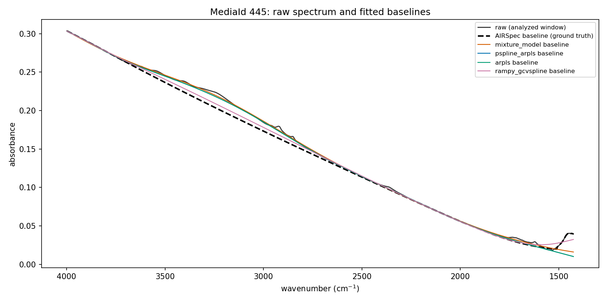
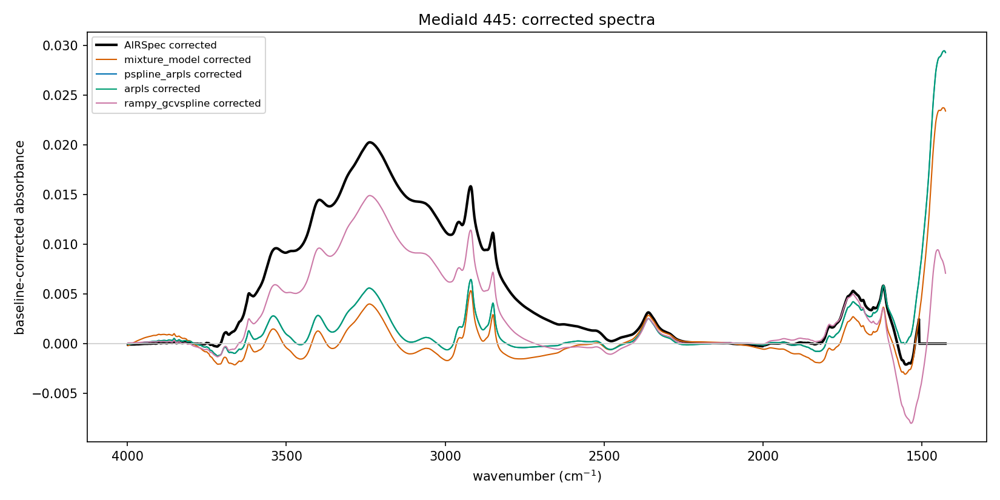
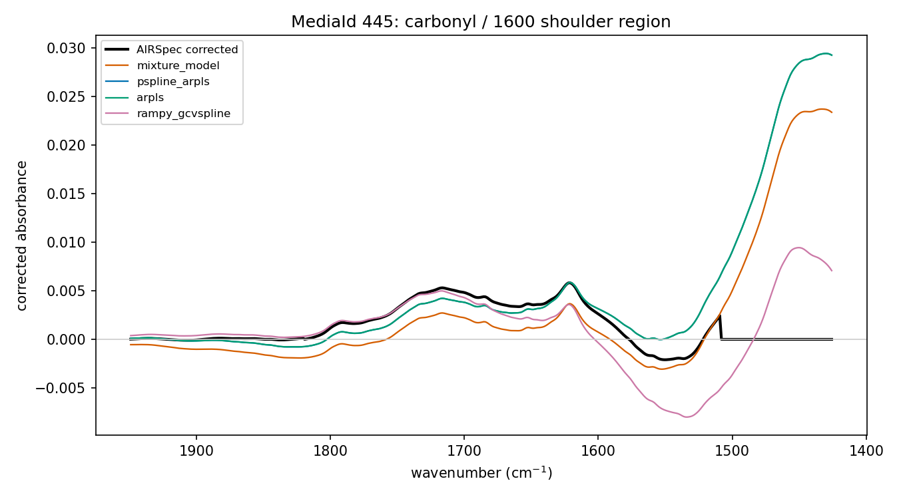

# Baseline-package trial: pybaselines / rampy vs the AIRSpec port

Trial of the baseline-correction candidates from
[`docs/package-survey-2026-08-17.md`](../../../docs/package-survey-2026-08-17.md)
(section 1) against the validated AIRSpec/APRLssb port
(`research/ftir_ec_phase3/scripts/airspec_baseline.py`, matches R to ~1e-7).
Run 2026-08-17. Everything here is reproducible with:

```bash
python research/package_trials/baselines/compare_baselines.py   # from repo root
```

## Versions

| Package | Version |
|---|---|
| python | 3.13.9 (anaconda, `/Users/ahmadjalil/anaconda3/bin/python`) |
| pybaselines | 1.2.1 |
| rampy | 0.6.4 |
| numpy / scipy / pandas | 2.3.5 / 1.16.3 / 2.3.3 |
| gcvspline (FORTRAN) | **not installed — not needed.** rampy 0.6.4's `"gcvspline"` mode is backed by `scipy.interpolate.make_smoothing_spline`, so it installs and runs cleanly with no compiler. |

## Methodology

- **Data**: 50 Addis (ETAD) PTFE spectra via
  `phase3_common.load_addis_evaluation()`, restricted to MediaIds with exactly
  **one** replicate row in the cached ground truth
  (`output/corrected/etad_corrected_df6.npz`, df1=6/df2=4). For singletons the
  replicate-averaged evaluation spectrum equals the raw row the cache was
  computed from, so the comparison is exact: re-running the port on this
  subset reproduces the cache to max RMS 8e-10 (float32 storage limit).
- **Grid**: candidates were given the analyzed window only
  (1425.8–3998.4 cm⁻¹, 2002 points, aligned to the cache by wavenumber). The
  port ran on the full raw grid (2722 points) as in production.
- **Candidates**: `pybaselines` `mixture_model` (penalized spline + EM, the
  survey's "nearest cousin"), `pspline_arpls`, `arpls` (chosen as the third
  variant: the classic full-rank Whittaker version, to test whether the
  P-spline approximation was the limiter — it wasn't; the two are nearly
  identical), and `rampy` `gcvspline` with an AIRSpec-like anchor ROI
  ([1426–1560], [1820–2250], [3600–3998] cm⁻¹).
- **Tuning**: each method's `lam`/`num_knots`/`p`/`s` grid-searched on the
  first 10 spectra, minimizing median RMS of the corrected spectrum vs the
  AIRSpec ground truth. No tuned value sits on a grid edge.
- **Metrics** (all 50 spectra, over the 2002-point window): per-spectrum RMS
  difference and Pearson r vs ground truth; median |delta| in the three band
  features from `pls_transfer.ftir_source_band_features` (`CH_peak`,
  `carbonyl_peak`, `shoulder_1600_peak`), also as % of the ground-truth
  median; wall-clock per spectrum (single process). Full table:
  `results_summary.csv`.

## Results

Median corrected-spectrum amplitude for scale: CH peak height ≈ 0.006 AU.

| Method | Tuned settings | Median RMS | p90 RMS | Median r | Min r | ms/spectrum | Δ CH | Δ carbonyl | Δ 1600 shoulder |
|---|---|---|---|---|---|---|---|---|---|
| AIRSpec port (reference) | df1=6, df2=4 | — | — | — | — | 74.0 | — | — | — |
| pybaselines `mixture_model` | lam=1e4, knots=50, p=1e-3 | 0.0033 | 0.0066 | 0.873 | **−0.197** | 2.6 | 6.8 % | 3.0 % | 4.6 % |
| pybaselines `pspline_arpls` | lam=1e4, knots=200 | 0.0040 | 0.0075 | 0.691 | −0.005 | 2.9 | 6.1 % | 19.4 % | 9.7 % |
| pybaselines `arpls` | lam=1e7 | 0.0040 | 0.0075 | 0.691 | −0.005 | 4.6 | 6.1 % | 19.4 % | 9.7 % |
| rampy `gcvspline` + anchor ROI | s=1.0 | **0.0013** | 0.0024 | **0.980** | 0.904 | 5.2 | 1.0 % | 23.1 % | 26.4 % |

Δ columns are median |candidate − ground truth| as % of the ground-truth
median feature value.





(`pspline_arpls` is hidden under `arpls` in the figures — they are visually
indistinguishable.)

## What the numbers mean

1. **The automatic methods flatten the broad 2800–3600 cm⁻¹ envelope.**
   arPLS-style reweighting treats any broad hump as baseline; fig. 2 shows
   the ~0.02 AU OH/CH envelope that AIRSpec's adaptive bound deliberately
   retains being absorbed into the baseline by `mixture_model`/`arpls`
   (median r 0.69–0.87, occasional sign flips: min r < 0). That envelope is
   part of the analyte signal the EC calibration uses, so this is a
   scientific disagreement, not a tuning problem — pushing `lam` up recovers
   the envelope but then the segment-2 region degrades.
2. **Anchor windows are the load-bearing part, not the spline engine.** The
   one candidate told *where* the baseline is (rampy gcvspline through
   AIRSpec-like no-analyte windows) reaches r ≈ 0.98 / RMS 0.0013 despite
   using a completely different spline machinery. What it still cannot copy
   is the port's *adaptive* behavior: the per-spectrum segment-1 bound search
   (`find_bound`) and segment-2 first-minimum anchor, plus the convention of
   pinning corrected ≡ 0 below the ~1510 cm⁻¹ minimum (all candidates ramp
   into the PTFE band edge there, visible in fig. 3; that tail plus the
   1520–1600 dip drive its 23–26 % carbonyl/shoulder deltas).
3. **Even the best candidate is not equivalence.** RMS 0.0013 is ~20 % of a
   typical CH peak height. Against a port validated to 1e-7 vs R, every
   candidate is a method change, not a re-implementation.
4. **Speed is the one clear win** — 2.6–5.2 ms/spectrum vs 74 ms/spectrum for
   the port (single process, full-grid, including its bound-search refits) —
   but the port already parallelizes and the whole ETAD+IMPROVE cache build
   is minutes, so this buys nothing that matters.

## Verdict

**No — pybaselines cannot replace the port's internals for production Addis /
IMPROVE processing.** Its automatic spline/Whittaker methods (best:
`mixture_model`, lam=1e4, knots=50, p=1e-3) disagree with the validated
AIRSpec output at the level of the analyte signal itself (median RMS ≈ 0.003
AU ≈ half a CH peak, with occasional badly-corrected spectra), because no
weighting scheme rediscovers APRLssb's anchor-window + adaptive-bound logic.
The survey's framing ("replace the spline internals, keep our segment logic
as a wrapper") is half-confirmed by the rampy result: anchored fitting
recovers 98 % correlation. But a hybrid would still have to keep
`find_bound`, `find_min_pos`, the segment stitching, *and* R's
df-parameterized `smooth.spline` semantics to preserve the 1e-7 validation —
at which point nothing of substance has been outsourced. **Keep the port.**

Legitimate uses for the packages here: quick exploratory baselines on
non-PTFE spectra, or as an independent cross-check that conclusions are not
baseline-method artifacts. If a pybaselines-based path is ever revisited, the
route is its weighted P-spline fits driven by the port's own masks — but that
requires a per-fit df→lam calibration and still changes the penalty type
(discrete differences vs integrated second derivative), so it should be
treated as a new method requiring re-validation, not a drop-in.

## Files

- `compare_baselines.py` — the runnable comparison (this whole trial)
- `results_summary.csv` — full metrics table
- `fig1_baselines_overlay.png`, `fig2_corrected_overlay.png`,
  `fig3_carbonyl_zoom.png` — representative spectrum (MediaId 445, median
  CH peak)
