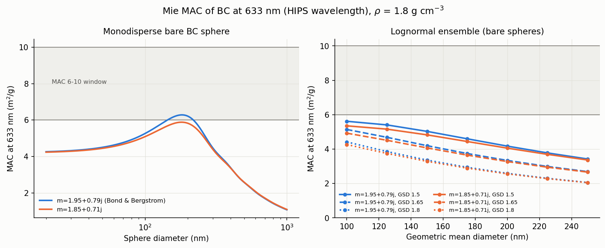

# Domain-package trials — PyMieScatt / monetio / AeroViz (2026-08-17)

Trials of the section-3 (aerosol/domain) recommendations from
`docs/package-survey-2026-08-17.md`, run in the default anaconda env
(Python 3.13.9). Scripts in this folder are runnable as-is:

- `mac_sweep.py` — PyMieScatt MAC-of-BC sweep at 633 nm → `mac_vs_diameter.png`
- `aeronet_pull.py` — monetio AERONET v3 pull for the Addis site

## Versions installed / environment impact

| Package | Version | How installed |
|---|---|---|
| PyMieScatt | 1.8.1.1 | `pip install PyMieScatt` (pulled `shapely` 2.1.2) |
| monetio | 0.3.2 | **not on PyPI** (404) — `pip install --no-deps "git+https://github.com/noaa-oar-arl/monetio.git"` + `cftime` 1.6.5, `netCDF4` 1.7.4 |
| AeroViz | 0.4.2 | `pip install --no-deps AeroViz` + `windrose` 1.10.0, `cartopy` 0.25.0 (with `pyproj`, `pyshp`) |

Post-install environment check: `import pandas, sklearn, flask` all still work;
nothing was upgraded or downgraded. Two AeroViz declared conflicts were
deliberately **not** honored (via `--no-deps`) and do not affect the readers:
it pins `rich~=13.9.4` (env has 14.2.0, works) and `numba>=0.63` (env has
0.62.1, never imported by the reader path). `cartopy` *is* unavoidable —
`AeroViz/__init__.py` imports the plot stack, so even
`from AeroViz.rawDataReader import RawDataReader` fails without it.

Compatibility gotchas found:

- **PyMieScatt is broken on SciPy >= 1.14 out of the box** — it imports the
  removed `scipy.integrate.trapz`. Shim before importing (see `mac_sweep.py`):
  `scipy.integrate.trapz = np.trapezoid`. Upstream is dormant; this shim (or a
  vendored fork) is part of adopting it.
- **monetio + AERONET is rate-limited** (~10 hits/min; monetio hits the URL
  twice per call). Back-to-back pulls transiently raise
  `"valid query but no data found"` — retry after a pause before concluding a
  site has no data. (This bit us: the first Jackros pull failed, the identical
  retry returned 565 rows.)

## 1. PyMieScatt — the MAC 6-vs-10 question at 633 nm (HIPS)

`mac_sweep.py`, ρ = 1.8 g/cm³, m = 1.95+0.79j (Bond & Bergstrom) and
1.85+0.71j. Ensemble MAC integrates Qabs and mass over the same discretised
lognormal, so the ratio is exactly B_abs/M.

Lognormal-ensemble MAC of **bare** BC spheres (m²/g):

| m | GSD | GMD 100 nm | 125 | 150 | 175 | 200 | 225 | 250 |
|---|---|---|---|---|---|---|---|---|
| 1.95+0.79j | 1.5 | 5.62 | 5.41 | 5.03 | 4.60 | 4.17 | 3.78 | 3.43 |
| 1.95+0.79j | 1.65 | 5.14 | 4.69 | 4.20 | 3.75 | 3.34 | 2.99 | 2.69 |
| 1.95+0.79j | 1.8 | 4.42 | 3.86 | 3.36 | 2.94 | 2.59 | 2.30 | 2.06 |
| 1.85+0.71j | 1.5 | 5.35 | 5.16 | 4.83 | 4.44 | 4.06 | 3.70 | 3.37 |
| 1.85+0.71j | 1.65 | 4.93 | 4.51 | 4.07 | 3.65 | 3.28 | 2.95 | 2.66 |
| 1.85+0.71j | 1.8 | 4.27 | 3.75 | 3.29 | 2.89 | 2.56 | 2.28 | 2.05 |

- **Bare-sphere ensemble MAC spans 2.05–5.62 m²/g across the whole
  parameter space — it never reaches 6.** Even the monodisperse optimum only
  peaks at **6.28 m²/g (D = 181 nm, m = 1.95+0.79j)** / 5.88 (m = 1.85+0.71j).
- Core-shell absorption enhancement (non-absorbing shell m = 1.55+0j),
  E_abs = C_abs(coated)/C_abs(bare core), cores 150–200 nm:
  D_shell/D_core 1.2 → **E_abs ≈ 1.2**; 1.5 → **≈ 1.5**; 1.8 → **≈ 1.8**;
  2.0 → **≈ 1.9–2.0** (both refractive indices).
- Referenced to BC-core mass, coated-ensemble MAC ≈ bare value × E_abs:
  a fresh/thinly-coated aerosol (E_abs ≲ 1.2) with GMD 100–150 nm, GSD ≤ 1.65
  lands at **5–6.7 m²/g — i.e. MAC 6 is the thin-coating / externally-mixed
  answer**. Reaching **MAC 10 requires E_abs ≈ 1.8–2 on top of a
  compact (GSD ~1.5), 100–150 nm distribution — i.e. heavily aged,
  thickly coated (D_shell/D_core ≈ 1.8–2), fully internally mixed BC.**
  Broad or coarse distributions (GSD 1.8, GMD ≥ 200) cannot reach 10 even
  with E_abs = 2.
- Reading for the HIPS fork: **MAC 6 and MAC 10 are not two calibrations of
  the same thing — they encode two different mixing-state assumptions.**
  For Addis (fresh urban sources close to the site) the Mie picture leans
  toward the lower half of the 6–10 window unless coating/aging evidence says
  otherwise.

## 2. monetio — AERONET v3 for Addis Ababa

`aeronet_pull.py`. Key findings:

- **`'Addis_Ababa'` is not a valid siteid** and name-greps for
  addis/ethio find nothing. The Addis sites (found by lat/lon box) are
  **`AAU_ET`** (2020-01-01..2022-10-14, ended) and **`AAU_Jackros_ET`**
  (2022-10-15..present, active) — both Addis Ababa University, 9.02 N /
  ~38.8 E, 2370 m, PI Araya Asfaw. Jackros matches the repo's Jacros
  aethalometer site.
- Daily AOD15 pull for 2024–2025: **shape (565, 58)**, DatetimeIndex
  2023-12-31..2025-11-13 (`daily=True` returns time as the index, not a
  column; the service includes one boundary day before the request).
- AOD wavelengths with data at this site: **340, 380, 440, 500, 675, 870,
  1020, 1640 nm** (other channels are all-NaN placeholders), plus
  precipitable water and five precomputed Ångström exponents
  (440-870, 380-500, 440-675, 500-870, 340-440).
- **Inversion products work and carry exactly what the project wants**:
  `product="TAB", inv_type="ALM15"` for 2024 returned **(190, 18)** with
  `absorption_aod[440/675/870/1020nm]` and
  `absorption_angstrom_exponent_440-870nm`, all 190 days valid. That is
  column-level AAOD + AAE to put beside the MA350 AAE and the HIPS 633 nm
  absorption.

## 3. AeroViz — MA350 reader vs our raw files

Real raw MA350 data exists (Google Drive, not in-repo):
`Davis Data/Aethelometry Data/Raw/Jacros_MA350_1-min_2022-2024_Cleaned.csv`
(1,095,086 rows, firmware 1.1, "Data format version 1", serial MA350-0238;
also `Pasadena_MA350_1-min_2023-2024_Cleaned.csv`). Trialed on a 3000-row
sample.

- **As-is, the reader fails on our export** ("All files were either empty or
  failed to read"): `Reader._raw_reader` hard-codes
  `parse_dates=['Date / time local']`, a column newer microAeth exports have,
  while our firmware-1.1 export has separate `Date local (yyyy/MM/dd)` and
  `Time local (hh:mm:ss)` columns.
- **A one-line preprocess fixes it** (combine the two columns into
  `Date / time local`): the full pipeline then runs — 3051 rows in →
  85 columns out, including renamed `BC1..BC5` (UV..IR BCc), derived
  `abs_375/470/528/625/880`, interpolated `abs_550`, `AAE`, `eBC`, and a
  `QC_Flag` (2613/3051 valid on the sample; flags for status-code errors,
  BC range, hourly completeness).
- Fit notes for our use: its wavelength set matches `config.WAVELENGTHS_NM`
  (375/470/528/625/880). Its QC ceiling `MAX_BC = 20000 ng/m³` would flag
  genuine Addis peaks (our BCc means run ~6000 ng/m³ with episodes well
  above 20 µg/m³) — the threshold is a class attribute, overridable.
  `RawDataReader` wants a *directory* of files and writes pkl/csv/report
  side-products (disable with `save_*=False`, point `output_dir` elsewhere —
  never at the read-only Drive mount).
- The repo's own pipeline starts from already-processed pickles
  (`processed_sites/df_*_9am_resampled.pkl`, same `UV/Blue/.../IR BCc`
  column family), so there is no in-repo raw loader to displace; AeroViz
  would slot in *upstream* of those pickles if adopted.

## Verdicts

| Package | Verdict | Why |
|---|---|---|
| PyMieScatt | **Adopt** (with the SciPy shim, ~3 lines) | Does exactly the MAC-theory job; results ground the 6-vs-10 fork. Dormant upstream — pin + shim, or vendor the ~200 relevant lines if the shim ever stops sufficing. |
| monetio | **Adopt for AERONET** | Not-on-PyPI install is a one-liner from NOAA's repo; daily AOD *and* ALM15 absorption/AAE inversions come back as tidy DataFrames. Wrap pulls in a retry to absorb the rate limit. Site discovery needs lat/lon, not names. |
| AeroViz | **Borrow, don't depend** | The MA350 QC logic (status bitmask, BC range, completeness, AAE gate) and BC→abs conversion are worth reusing, and work after a one-line timestamp preprocess. But as a dependency it is heavy (cartopy required just to import the reader) and its pins (`rich~=13.9.4`, `numba>=0.63`) conflict with our env. Either vendor the MA350 reader+QC (~2 files) or keep the `--no-deps` install recipe above documented. |
